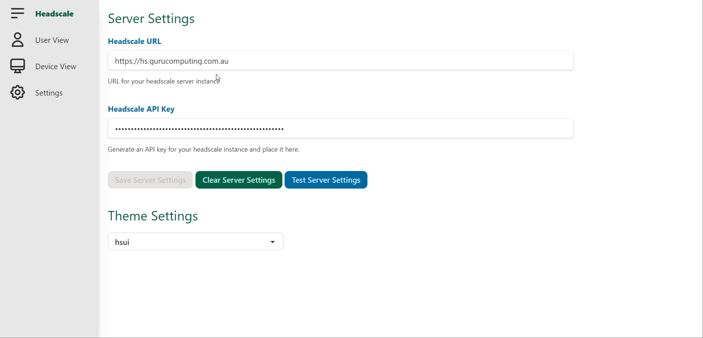

# Headscale-UI
A web frontend for the [headscale](https://github.com/juanfont/headscale) Tailscale-compatible coordination server.



## Installation
> [!WARNING]  
> The latest major release of headscale ui change the default container ports from `80` and `443` to `8080` and `8443` respectively. If you are using the `HTTP_PORT` or `HTTPS_PORT` environment variables this does not affect you, otherwise you need to change your ports in your docker-compose or kubernetes manifests.

Headscale-UI is currently released as a static site: just take the release and host with your favorite web server. Headscale-UI expects to be served from the `/web` path to avoid overlap with headscale on the same domain. Note that due to CORS (see https://github.com/juanfont/headscale/issues/623), headscale UI *must* be served on the same subdomain, or CORS headers injected via reverse proxy.

### Docker Installation
If you are using docker, you can install `headscale` alongside `headscale-ui`, like so:

```yaml
version: '3.5'
services:
  headscale:
    image: headscale/headscale:stable
    container_name: headscale
    volumes:
      - ./container-config:/etc/headscale
      - ./container-data/data:/var/lib/headscale
    # ports:
      # - 27896:8080
    command: serve
    restart: unless-stopped
  headscale-ui:
    image: ghcr.io/gurucomputing/headscale-ui:latest
    restart: unless-stopped
    container_name: headscale-ui
    # ports:
      # - 8443:8443
      # - 8080:8080
```

Headscale UI serves on port 8080/8443 and uses a self signed cert by default. You will need to add a `config.yaml` file under your `container-config` folder so that `headscale` has all of the required settings declared. An example from the official `headscale` repo is [here](https://github.com/juanfont/headscale/blob/main/config-example.yaml). 

### Additional Docker Settings
The docker container lets you set the following settings:
| Variable | Description | Example |
|----|----|----|
| HTTP_PORT | Sets the HTTP port to an alternate value | `8080` |
| HTTPS_PORT | Sets the HTTPS port to an alternate value | `8443` |

### Proxy Settings
You will need a reverse proxy to install `headscale-ui` on your domain. Here is an example [Caddy Config](https://caddyserver.com/) to achieve this:
```
https://hs.yourdomain.com.au {
	reverse_proxy /web* http://headscale-ui:8080
	reverse_proxy * http://headscale:8080
}


```

### Cross Domain Installation
If you do not want to configure headscale-ui on the same subdomain as headscale, you must intercept headscale traffic via your reverse proxy to fix CORS (see https://github.com/juanfont/headscale/issues/623). Here is an example fix with Caddy, replacing your headscale UI domain with `hs-ui.yourdomain.com.au`:
```
https://hs.yourdomain.com.au {
	@hs-options {
		host hs.yourdomain.com.au
		method OPTIONS
	}
	@hs-other {
		host hs.yourdomain.com.au
	}
	handle @hs-options {
		header {
			Access-Control-Allow-Origin https://hs-ui.yourdomain.au
			Access-Control-Allow-Headers *
			Access-Control-Allow-Methods "POST, GET, OPTIONS, DELETE"
		}
		respond 204
	}
	handle @hs-other {
		reverse_proxy http://headscale:8080 {
			header_down Access-Control-Allow-Origin https://hs-ui.yourdomain.com.au
			header_down Access-Control-Allow-Methods "POST, GET, OPTIONS, DELETE"
			header_down Access-Control-Allow-Headers *
		}
	}
}

```

### Other Configurations
See [Other Configurations](/documentation/configuration.md) for further proxy examples, such as Traefik

## Versioning
The following versions correspond to the appropriate headscale version
| Headscale Version | HS-UI Version |
|-------------------|---------------|
| 24+               | 2025-01-20+
| 23+               | 2024-10-01+   |
| 19+               | 2023-01-30+   |
| <19               | <2023-01-30   |

## Troubleshooting
Make sure you are using the latest version of headscale. Headscale-UI is only tested against:

* The current stable version of headscale
* Chrome/Chrome Mobile
* Firefox/Firefox Mobile

Note that while mobile is checked for functionality, the web experience is not mobile optimised.

If you are getting errors about preflight checks, it's probably CORS related. Make sure your UI sits on the same subdomain as headscale or inject CORS headers.

### Errors related to "Missing Bearer Prefix"
Your API key is either not saved or you haven't configured your reverse proxy. Create an API key in `headscale` (via command line) with `headscale apikeys create` or `docker exec <headscale container> headscale apikeys create` and save it in `settings`.

HS-UI *has* to be ran on the same subdomain as headscale or you need to configure CORS. Yes you need to use a reverse proxy to do this. Use a reverse proxy. If you are trying to use raw IPs and ports, it *will* not work.

## Security
see [security](/SECURITY.md) for details

## Development
see [development](/documentation/development.md) for details

## Style Guide
see [style](/documentation/style.md) for details

## Architecture
See [architecture](/documentation/architecture.md) for details
